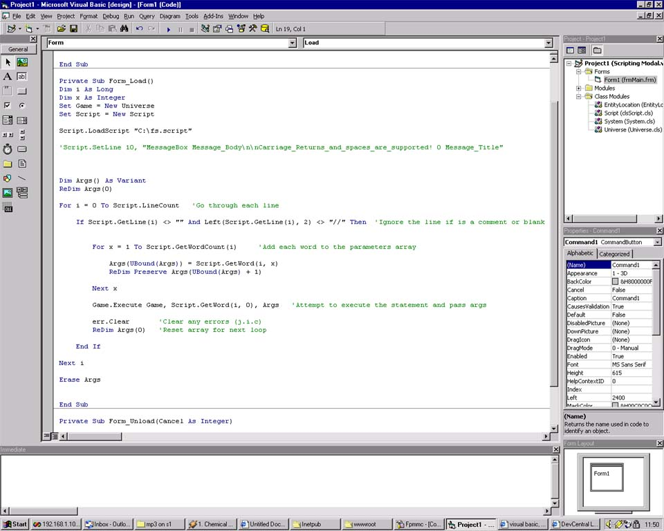



## clsScript

### Description

This VB Class allows you to quickly and easily read/write files, line by line, word by word.
 
### More Info
 

This is one of the base classes I have made for several games I am working on, all of which require scripting.

The screenshot shows how to make a basic parser (executes objects in another class by using CallByName() ).

I forgot to implement a "SetWord(lngLineNumber, intWordNumber)" function. I will update the code soon.

             |
---                |---
**Submitted On**   |2000-12-07 11:43:38
**By**             |[Neil Ramsbottom](https://github.com/Planet-Source-Code/PSCIndex/blob/master/ByAuthor/neil-ramsbottom.md)
**Level**          |Intermediate
**User Rating**    |4.0 (16 globes from 4 users)
**Compatibility**  |VB 5\.0, VB 6\.0
**Category**       |[Files/ File Controls/ Input/ Output](https://github.com/Planet-Source-Code/PSCIndex/blob/master/ByCategory/files-file-controls-input-output__1-3.md)
**World**          |[Visual Basic](https://github.com/Planet-Source-Code/PSCIndex/blob/master/ByWorld/visual-basic.md)
**Archive File**   |[CODE\_UPLOAD124221272000\.zip](https://github.com/Planet-Source-Code/neil-ramsbottom-clsscript__1-13399/archive/master.zip)

